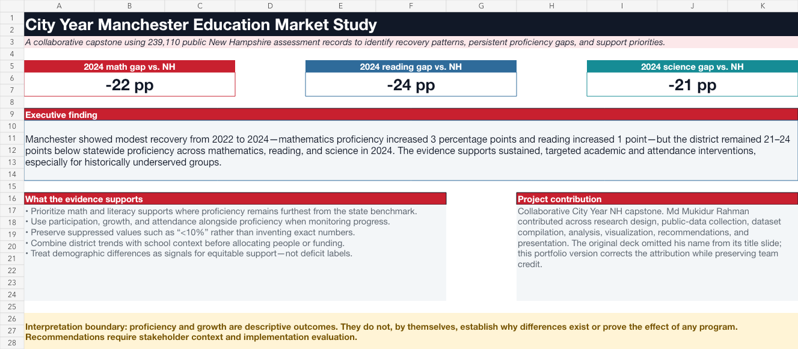

# City Year Manchester Education Market Study

A collaborative analytics capstone developed for City Year New Hampshire using 239,110 public assessment records to examine Manchester's post-pandemic education landscape, benchmark outcomes, identify equity-sensitive support priorities, and strengthen program-planning conversations.

## Research question

How do Manchester's education outcomes and needs compare with statewide results and selected New Hampshire districts, and what evidence-informed priorities should City Year consider?

## Verified findings

- In 2024, Manchester proficiency was **19% in mathematics**, **29% in reading**, and **15% in science**.
- Manchester trailed the New Hampshire benchmark by **22 percentage points in mathematics**, **24 points in reading**, and **21 points in science**.
- From 2022 to 2024, Manchester improved **3 points in mathematics** and **1 point in reading**, while science declined **1 point**.
- Several public subgroup results were reported as **below 10% proficiency**. The portfolio preserves these bounded values and does not invent exact numbers.

## Recommendations

1. Prioritize classroom-aligned mathematics acceleration and high-dosage tutoring.
2. Pair literacy supports with attendance, engagement, and learner-specific differentiation.
3. Strengthen inclusive supports for multilingual learners, students with disabilities, and students experiencing housing instability.
4. Use participation, growth, attendance, and implementation dosage alongside proficiency.
5. Define evaluation baselines and comparison logic before attributing outcomes to program activity.

## Portfolio quality improvements

The recovered 48-slide classroom presentation mixed some annual and multi-year totals, relied on image-based charts without auditable source ranges, omitted a consolidated conclusion, and accidentally left Md Mukidur Rahman off the title-slide team list. This portfolio version:

- narrows the analysis to verified NH Department of Education assessment records;
- preserves public suppression rules such as `<10%` and `* n < 11`;
- separates findings from causal claims;
- connects each recommendation to evidence and an evaluation guardrail;
- documents individual contribution while preserving team credit; and
- excludes the problematic original deck from the public repository.

## Project contribution and team credit

This was a collaborative QSO 705 capstone. The original deck lists Laeticia, Niloy, Zin, Goutham, and Dweejesh. **Md Mukidur Rahman contributed across research design, public-data collection, dataset compilation, analysis, visualization, recommendations, and presentation**, but his name was omitted from the original title slide.

## Repository contents

- [`city-year-manchester-education-market-study.xlsx`](city-year-manchester-education-market-study.xlsx) — executive summary, benchmark analysis, district trends, equity lens, recommendations, methodology, and sources
- [`district_comparison.csv`](data/district_comparison.csv) — privacy-safe district and statewide analytical extract
- [`manchester_equity_2024.csv`](data/manchester_equity_2024.csv) — suppression-preserving Manchester and statewide subgroup extract
- [`validate_findings.py`](validate_findings.py) — compact reproducibility check for the headline findings

## Data sources

Primary source: [New Hampshire Department of Education Data and Reports](https://www.education.nh.gov/data-reports)

- [2021–22 disaggregated assessment data](https://www.education.nh.gov/sites/g/files/ehbemt326/files/inline-documents/sonh/assessment22.xlsx)
- [2022–23 disaggregated assessment data](https://www.education.nh.gov/sites/g/files/ehbemt326/files/inline-documents/sonh/disaggregateddata2023.xlsx)
- [2023–24 disaggregated assessment data](https://www.education.nh.gov/sites/g/files/ehbemt326/files/inline-documents/sonh/disagdata2024.xlsx)

## Interpretation boundary

The analysis is descriptive. Differences in proficiency, participation, growth, or attendance do not establish causes, program impact, school quality, teacher effectiveness, or student potential. Operational decisions should incorporate current data, stakeholder context, implementation capacity, and a defined evaluation design.

## Skills demonstrated

Stakeholder research · Public-sector analytics · Data compilation · Data validation · Benchmarking · Equity-sensitive analysis · Suppression handling · Excel reporting · Data visualization · Program recommendations · Evaluation design · Team collaboration
